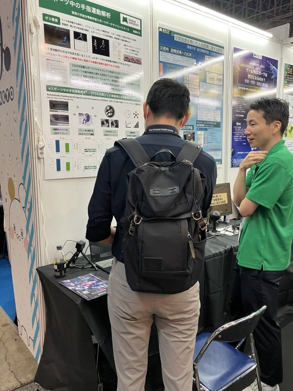
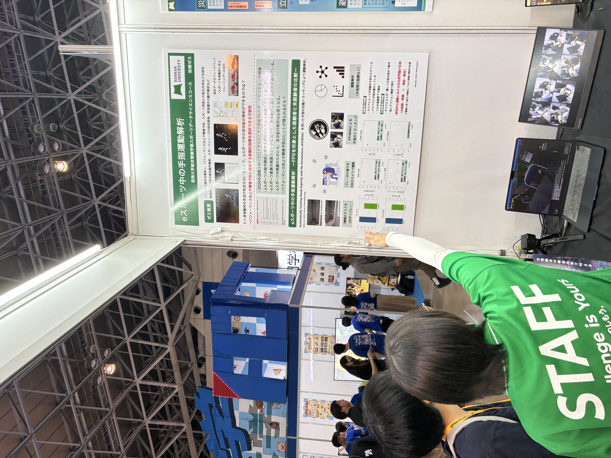

## お知らせ

- 2026-08-12: 研究室ホームページを開設しました。
- 2026-09-17~18: 東京ゲームショウに出展してきました。

  {width=60%} 
  展示では、普段行っているフットウェアに関する研究やスポーツ動作の測定の説明に加えて、eスポーツの手指解析を行った結果を説明しました。手指解析のデモも同時に行い、多くの人にご来場いただきました。 
  {width=60%} 
  ゼミ学生も、来場者に対して丁寧に説明を行いました。説明を重ねるにつれ、より良い表現が行えるようになったと同時に、自身の理解できていない点も整理できたようで、更なる成長が期待されます。

- 2026-09-23~26: アジア競技大会に、日本陸上競技連盟の活動として参加してきました。

## 参加予定のイベント等
- 2026-10-23~25: アジアスポーツバイオメカニクス学会（発表） 
- 2026-11-13~14: 日本バイオメカニクス学会 
- 2026-12-5~6: 日本野球学会（ゼミ学生発表予定） 
